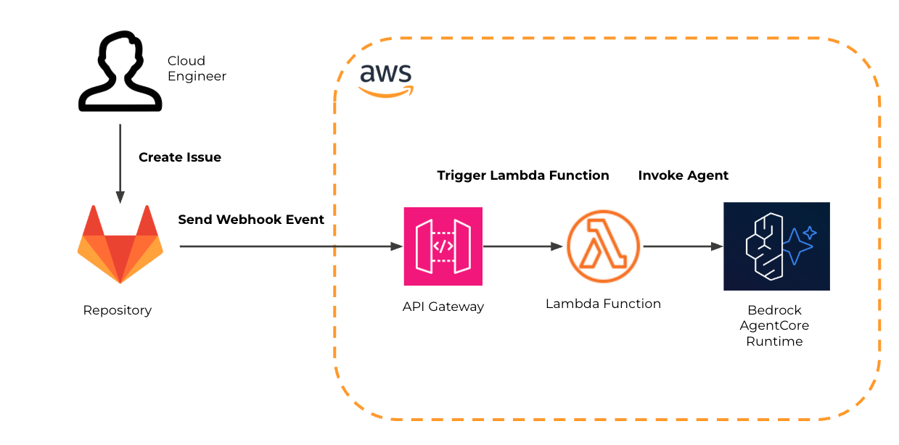
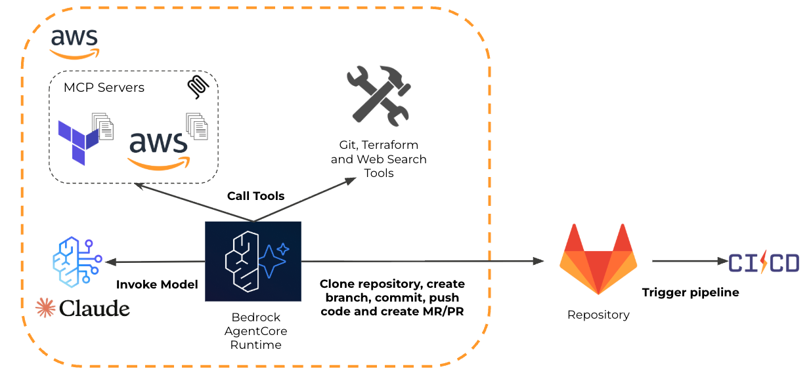

## Cloud Engineer Agent

An autonomous AI agent built on [Strands Agents](https://github.com/strands-agents/sdk-python) and [AWS Bedrock AgentCore](https://aws.amazon.com/bedrock/agentcore/) that implements cloud infrastructure features from GitLab issues. It clones repositories, writes Terraform and frontend code following enforced best practices, validates changes, and creates merge requests — end to end, without human intervention.

### Architecture Overview

The system follows a two-stage workflow:

**Stage 1: Issue to Agent Invocation**


**Stage 2: Agent Processing and CI/CD Trigger**


### Key Features

- **Autonomous issue-to-MR workflow**: parses GitLab issues, implements changes, validates, pushes, and creates merge requests
- **Best Practices Skills**: Strands AgentSkills plugin with progressive disclosure — backend (Terraform, Lambda, IAM, observability) and frontend (vanilla JS, accessibility, security) guidelines are automatically activated before any code is written
- **Terraform verification pipeline**: `terraform init` -> `tflint` -> `Checkov` security scan -> `terraform plan` — all must pass before pushing
- **MCP tool integrations**: AWS Terraform provider docs, AWS documentation search, Checkov security scanning via MCP servers
- **Bedrock AgentCore runtime**: containerized agent deployed as a managed serverless runtime on AWS
- **GitLab webhook ingestion**: Lambda + API Gateway receives GitLab events and invokes the agent
- **Observability**: Langfuse tracing via OTLP for full LLM call visibility
- **Session continuity**: file-based session manager for multi-turn agent interactions

### Agent Workflow

When a GitLab issue is received, the agent executes the following steps autonomously:

1. **Clone** the target repository branch
2. **Analyze** existing codebase (only files relevant to the issue)
3. **Activate skills** — backend and/or frontend best practices loaded on-demand via the `skills()` tool
4. **Create** a feature branch (`feature/issue-<id>-<title>`)
5. **Implement** changes following the activated skill guidelines
6. **Validate** — run the full Terraform verification sequence (init, tflint, Checkov, plan)
7. **Push** changes (only after all validations pass)
8. **Create merge request** following a strict template (What, Why, Testing, Notes)

### Skills System

The agent uses [Strands AgentSkills](https://strandsagents.com/docs/user-guide/concepts/plugins/skills/) for progressive disclosure of best practices:

- **`applying-backend-best-practices`** — Terraform structure and naming conventions, validation workflow, Lambda Python 3.12 with Layers, IAM least privilege, CloudWatch observability, AWS Well-Architected Framework
- **`applying-frontend-best-practices`** — Vanilla JS ES6+, WCAG AA accessibility, CSS BEM methodology, XSS prevention, performance optimization, responsive design

Skills are **mandatory**: the system prompt enforces activation before any code is written. Post-execution verification logs a warning if no skills were activated.

Each skill uses a `SKILL.md` with YAML frontmatter (injected at startup) and reference files loaded on-demand only when needed.

## Prerequisites

- AWS account and credentials (role or profile)
- Python 3.12+
- Terraform >= 1.12
- Docker for building the agent image

## Configuration

### Terraform Variables

These important variables should be provided via `*.tfvars` or `-var` flags:
- `aws_region` (default: `us-west-2`)
- `state_bucket_name` (S3 bucket for remote state)
- `gitlab_url` (default: `gitlab.example.com`)
- `gitlab_audience` (default: `https://gitlab.example.com`)
- `gitlab_project_path` (default: `your-group/your-project`)
- `user_id` (default: `user@example.com`)
- `langfuse_otlp_endpoint` (default: empty to disable)

See `terraform/variables.tf` for the complete list and defaults.

### Environment Variables

Copy `agent/app/.env_example` to `.env` and set your values:
- `GITLAB_TOKEN`, `GITLAB_URI`, `GITLAB_REPO_BASE_URL`
- `LANGFUSE_PUBLIC_KEY`, `LANGFUSE_SECRET_KEY`, `LANGFUSE_HOST`
- `USER_ID`, `AGENT_ARN` (runtime ARN output after deploy)
- Optional: `AWS_PROFILE` for local utilities

Note: `.env`, `.env.*`, and `*.tfvars` are gitignored.

## Deploy

1. Initialize Terraform backend
   ```bash
   terraform -chdir=terraform init \
     -backend-config="bucket=<your-state-bucket>" \
     -backend-config="key=cloud-engineer-agent" \
     -backend-config="region=<your-region>"
   ```

2. Plan and apply
   ```bash
   terraform -chdir=terraform apply \
     -var="state_bucket_name=<your-state-bucket>" \
     -var="aws_region=<your-region>" \
     -var="gitlab_url=gitlab.example.com" \
     -var="gitlab_project_path=your-group/your-project"
   ```

3. Capture outputs and set `AGENT_ARN` accordingly in your environment.

## Local Usage

### Run with a GitLab Issue

```bash
cd agent && uv pip install .
cd app && python main.py \
  --issue-id 42 \
  --issue-file ../examples/sample_issue.md \
  --project-name my-project \
  --target-branch main
```

Options:
- `--dry-run` — validate issue parsing without running the agent
- `--session-id <uuid>` — continue an existing session
- `--prompt "extra instructions"` — append additional instructions
- `--verbose` — enable debug logging
- `--output results.json` — save results to file

### Interact with Deployed Runtime

```bash
export AWS_PROFILE=your-profile
export AGENT_ARN=arn:aws:bedrock-agentcore:...:runtime/...
python agent/interact_with_runtime.py
```

### Docker Build

```bash
cd agent && docker build -t cloud-engineer-agent:latest .
```

## Project Structure

```
agent/                          # Dockerized agent runtime
  app/
    cloud_engineer_agent.py     # Main agent orchestration
    git_tools.py                # Git operations (clone, branch, push, MR)
    terraform_command_tools.py  # Terraform init & plan
    mcp_servers.py              # MCP clients (AWS docs, Checkov)
    prompts.py                  # System & user prompt templates
    ai_models.py                # Bedrock model configuration
    skills/                     # Strands AgentSkills
      applying-backend-best-practices/
        SKILL.md                # Skill metadata + checklist
        references/             # Terraform, Lambda, security, observability guides
      applying-frontend-best-practices/
        SKILL.md
        references/             # Structure, accessibility, CSS, security guides
  runtime.py                    # Bedrock AgentCore entry point
  Dockerfile                    # Container image (Python 3.12, Terraform, tflint, glab)
  .bedrock_agentcore.yaml       # AgentCore runtime configuration
terraform/                      # Infrastructure as code
  agentcore_runtime.tf          # Bedrock AgentCore runtime
  lambda.tf                    # Webhook handler Lambda
  api_gateway.tf               # REST API endpoint
  iam.tf                       # IAM roles and policies
  oidc.tf                      # GitLab OIDC authentication
  secrets.tf                   # Secrets Manager
examples/                       # Sample GitLab issues for testing
diagrams/                       # Architecture diagrams
```

## Contributing

Contributions are welcome. Please avoid committing secrets, ARNs, or account-specific identifiers. Use variables and environment files instead.

## License

MIT
